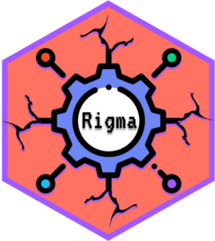

<!-- README.md is generated from README.Rmd. Please edit that file -->

# Rigma <a href="https://alekoure.github.io/Rigma/" rel="nofollow"></a>

<!-- badges: start -->

[](https://github.com/AleKoure/Rigma/actions)
[](https://app.codecov.io/gh/AleKoure/Rigma?branch=main)
[](https://CRAN.R-project.org/package=Rigma)
<!-- badges: end -->

The goal of Rigma is to provide a user friendly client to ‘Figma’ API.
It uses the latest `httr2` for a stable interface with the ‘Figma’ API.
More than 20 methods are provided to interact with ‘Figma’ files, and
teams. Get design data into R by reading published components and
styles, converting and downloading images, getting access to the full
‘Figma’ file as a hierarchical data structure, and much more. Enhance
your creativity and streamline the application development by automating
the extraction, transformation, and loading of design data to your
applications and documents.

## Installation

You can install the development version of ‘Rigma’ from
[GitHub](https://github.com/) with:

``` r
# install.packages("devtools")
devtools::install_github("AleKoure/Rigma")
```

## Getting started

An account can be accessed using an API by the owner of a personal
access token just as if they were the user who created the token.

Make your own access token.

- Open your Figma account and log in.
- From the top-left menu in Figma, select Account Settings.
- Locate the section on personal access tokens.
- Select New Token by clicking.
- There will be a token created. This will be your last opportunity to
  copy the token, so be careful to store a copy of it safely.

When you retrieve the personal access token save it as an environmental
variable (e.g. edit `.Renviron` by typing `usethis::edir_r_environ()`).

    FIGMA_ACCESS_TOKEN="YOUR_ACCESS_TOKEN_GOES_HERE!!!"

After saving your changes restart R session.

## Example

Open ‘Figma’ and navigate to your favorite file. In the URL you can see
the key of the file. To retrieve the File as an R object execute:

    example_file_key <- "sFHgQh9dL6369o5wrZHmdR"
    get_file(example_file_key)

A tree of nodes is used to represent the ‘Figma’ file. Every file has a
DOCUMENT node at the root, and any CANVAS nodes branch out of that node.
