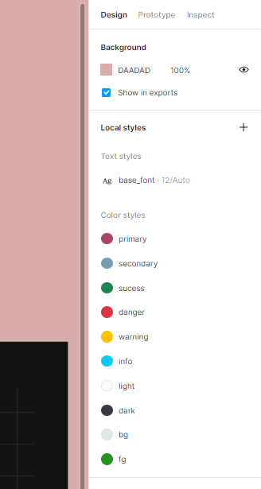

```{r, include = FALSE}
knitr::opts_chunk$set(
  collapse = TRUE,
  comment = "#>"
)
```

```{r setup}
library(bslib, warn.conflicts = FALSE)
library(rlang)
library(dplyr, warn.conflicts = FALSE)
```

# Introduction

In this example we will start by adding styles to a 'Figma' file. Then we will use
these variables to define the high level `bslib` variables used for stylizing
Shiny applications.

## Initial Steps

In order to get style data from a 'Figma' file using the REST API the following
steps should followed:

1) Create a Figma team

2) Create a Figma file and move it to the Figma team

3) Add your favorite styles (they should appear in the **Design** selection at the
top right of your screen)

4) Click Assets on the top left and select the book icon to **publish** your styles. 

## Adding Bootstrap variables - `bslib` 

The `bslib` library allows to manipulate the theme of a shiny application using
bootstrap variables. In these example we demonstrate how to use high level 
bootstrap variables to stylize your application.

The high level bootstrap variables are the arguments of the functions 
`bslib::bs_theme`.

```{r}
rlang::fn_fmls_names(bslib::bs_theme) %>%
  tail(-3)
```
By using these names as style names into a 'Figma' file we can directly manipulate
the theme of the Application.

Open the 'Figma' file and insert the styles of your choice using `blib` variable
names as printed from the previous chunk. On the right hand side of your screen 
you should get a View similar to the following:



After defining some of the variables that you want to modify navigate to the
top left and select Assets. Then, push the book button to publish the changes
on the file. Now the file is ready to be accessed from an R session using `Rigma`.

## Extract data to R

We can access published data via 'Figma' REST API.
Find the file id in the URL of the 'Figma' file. Then, collect style data:

```r
file_key <- "sFHgQh9dL6369o5wrZHmdR" #add your own file_key
style_data <- file_key %>%
  Rigma::get_file_styles() %>% 
  Rigma::as_design_tibble()
```

The color is encoded in thumbnail URLs provided by the API 
(alternatively you can get color metadata from node ids and using the 
`Rigma::get_file_nodes()` method). For this tutorial, we include an example 
function that collects color data using the thumbnail URLs, `add_color()`. 
We can get high level `bslib` color variables by executing:

```r
bslib_palette <- style_data %>% 
  Rigma::add_color() %>% 
  Rigma::extract_bslib_palette()
```

### Text data

Metadata about text can be extracted using the following function:

```r
text_data <- Rigma::text_data_from_styles(style_data)

#get base_font Figma style variable - see also snapshot
base_font <- text_data %>%
  filter(name == "base_font") %>%
  pull(fontFamily) %>%
  font_google()
```

### Creating `bs_theme` object

Collecting the font and color data we can create the `bs_theme` object that can
be used to stylize a shiny app

```r
bslib_vars <- bslib_palette %>%
  append(
    list(base_font = base_font)
  )
rigma_theme <- exec(bs_theme, !!!bslib_vars)
```

and the shiny app should read

```r
library(shiny)
ui <- navbarPage(
  theme = rigma_theme,
  ...
)
shinyApp(ui, function(...) {})
```
